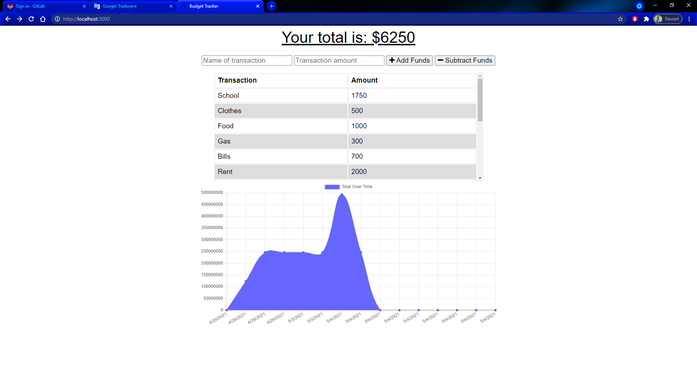

# Budget-Tracker

This app allows user to be able to add expenses and deposits to their budget with or without a connection. When entering transactions offline, it should sync the total when brought back online

## Photo:

---
## Run
**2.Open 2nd command line** - `npm run seed`

**3.Run the this command to start your server** - `npm start`

## Credits:
* [npm](https://www.npmjs.com/)
* [Heroku](www.heroku.com)
* [Bootstrap](https://getbootstrap.com/)
* [Google](https://www.google.com/)
* [W3Schools](https://www.w3schools.com/)

## Contributors:

* matachemarius92@gmail.com
* [Matache Marius](https://github.com/MatacheMarius)
## Directory:
* [Current Repository](https://matachemarius.github.io/Workout-Tracker/)
* [Website](https://matachemarius.github.io/Workout-Tracker/)
* [Heroku Deployment](https://budget--trackers.herokuapp.com/)
